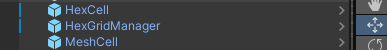

# HexGridSystem

#### [EN](README.EN.md)



这个项目是一个六边形网格系统，可用于在Unity游戏引擎中创建六边形地图。它提供了一组C#脚本，用于快速构建和管理六边形网格地图。

## 主要功能

- **HexCell**: 定义六边形网格单元的基本属性和行为
- **HexCoordinates**: 实现立方体坐标系统，便于六边形网格的定位和计算
- **HexGrid**: 管理六边形网格的创建、布局和更新
- **HexGridHighlight**: 提供网格单元的高亮和选择功能
- **HexMesh**: 动态生成六边形网格的网格模型，支持定制外观
- **HexMetrics**: 定义六边形几何参数和常量，确保网格一致性

## 系统要求

- Unity 2020.3 或更高版本
- .NET Framework 4.x

## 安装步骤

1. 将整个 HexGridSystem 文件夹复制到你的 Unity 项目的 Assets 目录下
2. 确保所有脚本和预制体都被正确导入

## 使用指南

### 基础设置

1. 在场景中创建一个空游戏对象，命名为 "HexGrid"
2. 将 `HexGrid.cs` 组件添加到该对象上
3. 配置 HexGrid 组件的参数：
   - Width: 设置网格的宽度
   - Height: 设置网格的高度
   - Cell Spacing: 设置六边形单元格之间的间距
   - 将 GridCell 预制体拖拽到 Grid Cell Prefab 字段

### 地形系统使用

```csharp
// 获取网格单元
GridCell cell = hexGrid.GetCellAtCoordinates(coordinates);

// 设置地形类型
cell.AddTerrain(TerrainType.Mountain);

// 检查地形类型
bool isMountain = cell.HasTerrain(TerrainType.Mountain);
```

### 坐标系统

```csharp
// 创建坐标
HexCoordinates coordinates = HexCoordinates.FromOffsetCoordinates(x, y);

// 获取相邻格子
HexCoordinates neighbor = coordinates.GetNeighbor(HexDirection.NE);
```

### 高亮系统

1. 将 `HexGridHighlight.cs` 添加到网格对象上
2. 配置高亮颜色和选择颜色
3. 使用示例：

```csharp
// 订阅格子选择事件
hexGridHighlight.OnCellSelected += (sender, args) => {
    GridCell selectedCell = args.Cell;
    // 处理选择逻辑
};
```

## 自定义扩展

### 自定义地形类型

在 `TerrainType.cs` 中添加新的地形类型：

```csharp
public enum TerrainType
{
    None = 0,
    Water = 1 << 1,
    Mountain = 1 << 2,
    Plane = 1 << 3,
    // 添加新的地形类型
    Forest = 1 << 4,
    Desert = 1 << 5
}
```

### 网格外观定制

修改 `HexMetrics.cs` 中的参数来调整六边形的大小和形状：

```csharp
public static class HexMetrics
{
    // 修改这些值来调整六边形大小
    public const float outerRadius = 1f;
    public const float innerRadius = outerRadius * 0.866025404f;
}
```

## 调试与优化

- 使用 Unity 编辑器中的 Scene 视图预览网格布局
- 调整 Cell Spacing 参数优化视觉效果
- 确保在大型地图中合理使用网格范围，避免性能问题

## 注意事项

- 这是一个3D六边形网格系统，如需2D效果请相应修改代码
- 确保所有必要的组件都已正确配置
- 大型地图可能需要考虑性能优化，如对象池等技术

## 技术支持

如有问题，请查看示例场景或提交 Issue。

## 许可证

MIT许可证
